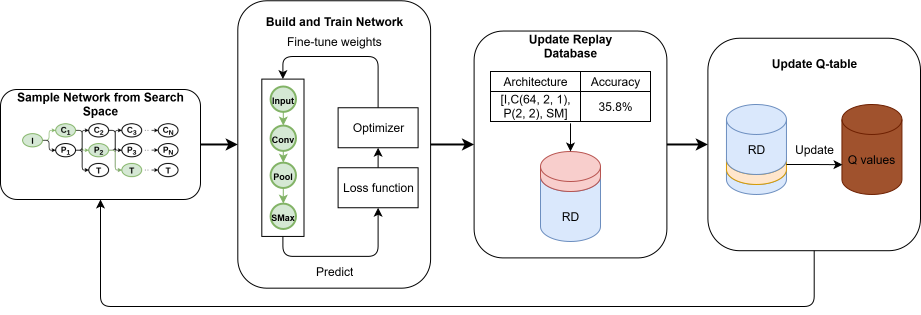
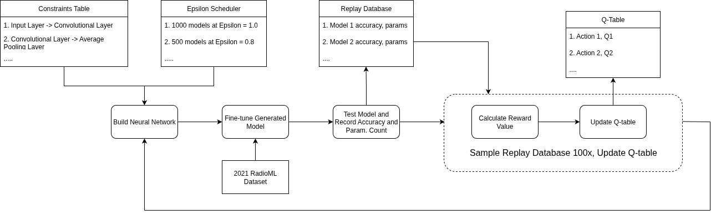

# DESIGN REPORT (FALL 2025)

## ARM Team Members
- Ashwin Ranjith Menon
- Project Advisor: Dr. Boyang Wang

## Project Description
Leveraging reinforcement learning to perform neural network architecture search to find ML models that will perform radio frequency modulation classification with a small parameter count.

## User Stories
1. As an algorithm developer, I want to implement an automated process that can perform architecture search for the purposes of modulation classification to accelerate the discovery of robust models for wireless communication systems

2. As an algorithm developer, I want to use reinforcement learning to explore novel model topologies so that I don't have to manually build and test configurations through trial and error

3. As an algorithm developer, I want to leverage I/Q signal data provided by RadioML to identify the most effective model for classifying modulation types

## Design Diagrams
### Level 0
This diagram shows a very high level overview of the process, simplifying the inputs, processes and outputs  

### Level 1
At this level, I emphasize the processes in a single learning iteration of the Q-learning process  

### Level 2
This is a detailed view of the entire Q-learning algorithm, highlighting all the inputs taken in at different points of time and also going over the repeated iterations that it goes through to learn and update the Q-table  

## Project Tasks
- Analyze background research paper for MetaQNN by Bowen Baker
- Research and find existing implementations of reinforcement learning to find small neural networks
- Procure dataset for radio signals (2021 RadioML)
- Analyze dataset to understand and unpack it
- Create baseline neural network model (and train it) for comparison with our final candidate models
- Smoke test RL implementation to see if replay database and Q-table are being initialized properly along with saved models
- Run small scale experiments (create around 100-200 models) each if necessary to fine-tune reward function
- Create scoring function to rank candidate models so that we can pick top-k models from the replay database
- Develop analysis methods to analyze the performance of candidate models
- Perform cleaning up and reorganization of code if necessary. Additionally, create pipelines for reproducibility

## Timeline

| Milestone                          | Start Date | Completion Date |
|------------------------------------|------------|------------------|
| Analyze MetaQNN Research           | 10/13/25   | 10/20/25         |
| Research RL Implementations        | 10/20/25   | 10/27/25         |
| Procure and Analyze Dataset        | 10/27/25   | 11/10/25         |
| Create Baseline Model              | 11/24/25   | 12/1/25          |
| Smoke Test RL System               | 12/1/25    | 12/22/25         |
| Conduct Small-Scale Experiments    | 12/22/25   | 12/28/25         |
| Develop Scoring Function           | 12/28/25   | 12/30/25         |
| Analyze Candidate Models           | 12/30/25   | 2/9/26           |
| Code Cleanup and Pipeline Setup    | 2/9/26     | -                |

**NOTE**: As the sole contributor to this project, a 100% of the tasks were/will be completed by me

## ABET Concerns
This project is influenced by several important constraints. Economically speaking, it relies on open-source frameworks and datasets such as Tensorflow and RadioML. Instead of using cloud computing resources to run the algorithm, I utilized the servers provided by my faculty advisor as part of his shared infrastructure. Although this enabled me to still make use of a high powered machine, due to its time intensive nature I could’ve benefited from using paid cloud servers. However, a price conscious decision was made to restrict myself to university resources instead.
It also furthered my professional skills in the fields of neural network architecture optimization, and reinforcement learning. Additionally, I was provided the opportunity to document my findings properly, to collaborate with other individuals and to perform research ethically. In these ways, this project directly contributed to my long term career development.
The project also has a major impact on society. It aims to improve modulation classification by utilizing neural networks instead of classic analytical methods. There’s also the additional benefit of reducing parameter count, which enables the use of these small neural networks on edge devices making them more accessible to the general public.  

## [Project Presentation](./Fall%20Design%20Presentation%20-%20Ashwin%20Menon.pdf)

## Individual Assessment
This project’s main focus is to develop lightweight neural network architectures to perform radio frequency modulation classification with a low parameter count. This will be performed by leveraging the Q-learning algorithm. Using Q-learning methods to perform architecture search could potentially even lead to the formation of novel neural network architectures. The main challenge lies in optimization of the state space, and reducing the time taken to perform exploration of said state space when running reinforcement learning experiments. This project serves as an opportunity for me to combine my interests in machine learning, and application of neural network architecture search methodologies. 
Many classes I’ve taken over my years as a computer science student here at UC play a huge role in guiding my project work. Courses such as **CS2028: Data Structures** and **STAT3037: Probability and Statistics** have equipped me with the analytical and mathematical tools necessary for understanding the efficiency and reliability of algorithms. **CS4071: Design and Analysis of Algorithms** also taught me how to estimate computing time of algorithms and gave an overview of the concept of “greediness”. **ENED1100: Engineering Design and Thinking I** and **ENED1120: Engineering Design and Thinking II** molded my way of thinking so that I could take the standard engineering way of problem solving to overcome issues by breaking them into smaller tasks, enabling me to think critically and handle problems with ease. Complementary to this existing knowledge was the coursework in **EECE 3093C: Software Engineering**, which taught me various tasking systems and corporate methodologies that let me finish work on time. Additionally, **CS2023: Python Programming** and **CS3003: Programming Languages** taught me object-oriented programming language fundamentals and all I need to know to work with Python.
My co-op experiences have further prepared me to take on this challenge by strengthening both my technical and professional skills. As a **Software Developer Co-Op at Midmark Corporation**, I gained extensive experience in developing enterprise software, implementing backend services, and working with APIs in a real-world environment. These roles taught me how to write clean, maintainable code, work within large systems, and validate solutions through rigorous testing. These skills will be applied when designing, training, and evaluating neural network architectures. Additionally, my role as an **Undergraduate Research Assistant** at the **University of Cincinnati** involved learning about reinforcement learning and the different types of radio modulation schemes that can be classified. These experiences not only honed my technical expertise but also enhanced non-technical skills such as communicating results, collaborating with cross-disciplinary teams, and approaching open-ended problems with creativity and persistence.
I am motivated to engage in this project because, as I stated before, it combines my interests in machine learning, and application of neural network architecture search methodologies. The idea of developing small models that can achieve strong classification performance compared to other, much bigger ones excites me because it enables us to deploy software that has the performance brought by artificial intelligence to edge devices like microcontrollers, mobile phones and IoT devices. In essence, there is potential in making machine learning more accessible and deployable to devices with much smaller compute power. My prior research experience showed me the potential for reinforcement learning to discover novel solutions in model design, and this project allows me to extend that work into a practical, impactful system. Not only is it an academic challenge, it also is a chance to make meaningful contributions to the ever evolving knowledgebase of artificial intelligence. 
My preliminary approach will involve defining the reinforcement learning framework, starting with Q-learning to iteratively evaluate and refine neural network architectures for modulation classification. I will establish baselines using standard models, then measure progress against accuracy, parameter count, and computational efficiency. I expect to achieve a balance between compactness and performance, producing architectures that significantly reduce resource requirements while maintaining high classification accuracy. To evaluate my contributions, I will measure accuracy and reduction rate in parameter count compared to a pre-established baseline. I will know I have succeeded when the models I develop outperform baseline tradeoffs, when my methodology is transparent and replicable, and when I can clearly communicate both the technical details and broader impact of the work.

## Contact Information
- **Email:** menonar@mail.uc.edu  
- **Phone:** (513) 837-7907  
- **LinkedIn:** [linkedin.com/in/ashwinranjith/](https://www.linkedin.com/in/ashwinranjith/)  
- **GitHub:** [github.com/ash-whut/](https://github.com/ash-whut/)  

### Co-op Work Experience

### Undergraduate Research Assistant — University of Cincinnati (2 semesters)
**Jan 2025 - Aug 2025** 
- Applied reinforcement learning to develop lightweight neural networks for radio signal modulation classification  
- Designed a model achieving a 99.13% reduction in parameters compared to baseline while maintaining 72.49% accuracy (baseline: 97.76%)  

### Software Developer Co-Op — Midmark Corporation (3 semesters) 
**Jan 2023 - Apr 2023, Aug 2023 - Dec 2023, Aug 2024 - Dec 2024**
- Developed and customized Salesforce applications for internal use  
- Implemented Oracle-to-Salesforce real-time integration, replacing scheduled CRON jobs with event-driven data transfer  
- Built and maintained Salesforce Apex backend services and API controllers  
- Developed the myMidmark mobile app with IoT device provisioning and registration capabilities  
- Designed end-to-end automated test suites for pre-release validation  
- Replaced local mobile database with in-app caching for efficient data storage  
- Created a quality assurance testing framework for assigned team  
- Investigated, identified, and resolved API call bugs in existing testing frameworks  

### Skills Gained
- **Programming Languages:** Python, C, C++, C# 
- **Scripting Languages:** Bash, PowerShell  
- **Frameworks:** .NET MAUI, Robot Framework, TensorFlow  
- **Version Control:** GitHub, Azure Git Repos  
- **Other Tools/Concepts:** Oracle EBS, Salesforce, Azure DevOps, MVVM architecture, Reinforcement Learning, Rapid Prototyping, Technical Writing  

### Areas of Interest
- Machine learning  
- Data analytics  
- Mobile application development  

### Project Sought
- Machine learning with a focus on novel architectures  
- Lightweight AI models deployable on edge devices  

## Expenses
All the tools and frameworks I used were open-source, and I ran the experiments on campus computing resources, so the project didn’t cost anything and won’t require any spending later on.

## Appendix
- [Designing Neural Network Architectures using Reinforcement Learning](https://arxiv.org/abs/1611.02167)
- https://github.com/bowenbaker/metaqnn
- https://github.com/AISyLab/Reinforcement-Learning-for-SCA
